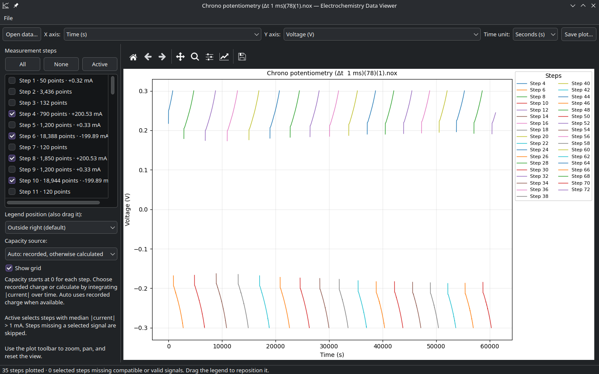
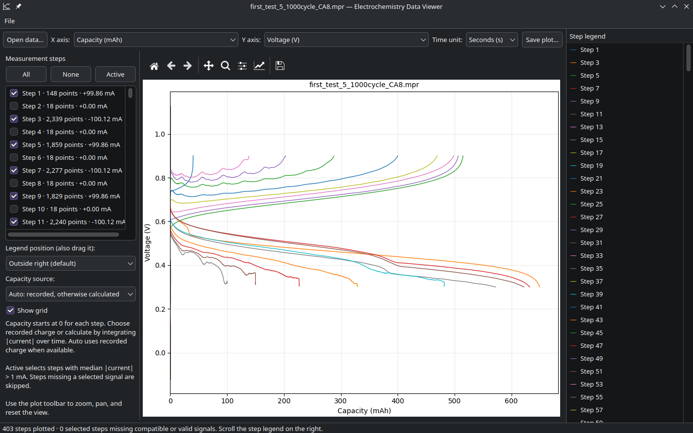

# Electrochemistry Data Viewer

Launch **Electrochemistry Data Viewer** from the applications menu, or double-click
a `.nox`, `.mpr`, `.mpt`, `.dta`, `.nda`, `.ndax`, or `.res` file. The project pins
the [Galvani fork](https://github.com/kevinsmia1939/galvani),
[gamry-parser](https://github.com/bcliang/gamry-parser), and
[NewareNDA](https://github.com/Solid-Energy-Systems/NewareNDA) as Git submodules.
The viewer uses these bundled readers, not unrelated installed versions.

## Screenshots

Time–voltage plot of a NOVA measurement:



Capacity–voltage plot of a BioLogic cycling measurement, with the scrollable step legend:



## Install on Linux

Python 3, Git, and the `venv` module are required. Clone with the submodules and
run the installer from any directory:

```bash
git clone --recurse-submodules https://github.com/kevinsmia1939/echem-data-viewer.git
bash echem-data-viewer/install.sh
```

If you already cloned without `--recurse-submodules`, the installer initializes
the submodules automatically. It creates `.venv`, installs PySide6, Matplotlib,
NumPy and pandas from `requirements.txt`, then installs a launcher and MIME associations for
the current user. No `sudo` is needed. On Linux, `desktop-file-validate`,
`update-mime-database`, `update-desktop-database` and `xdg-mime` must also be
available. The app itself does not need internet access after installation.
Arbin `.res` also needs the system `mdbtools` package (`mdb-export` on PATH).

## Install on Windows

Install Python 3 and Git, then run in PowerShell:

```powershell
git clone --recurse-submodules https://github.com/kevinsmia1939/echem-data-viewer.git
powershell -ExecutionPolicy Bypass -File .\echem-data-viewer\install-windows.ps1
```

The Windows installer creates `.venv`, installs the Python packages, adds a
Start Menu shortcut, and registers `.nox`, `.mpr`, `.mpt`, `.dta`, `.nda`, `.ndax`
and `.res` under the current
user (no administrator rights needed). Windows may retain an existing protected
default-app choice; if double-click opens another program, select the viewer in
**Settings → Apps → Default apps** or **Open with**. Use `-SkipFileAssociations`
to install without registering these extensions. Windows installation and GUI
behavior have not been run on Windows in this environment.
Arbin `.res` requires a separate MDBTools installation with `mdb-export` on PATH;
the Windows installer does not bundle it. Other formats need only the Python dependencies.

- Default axes: time (s) horizontally, voltage (V) vertically.
- **Time unit** selects seconds (default), hours, or days for time signals on
  either axis, including step time and BioLogic's raw time columns. Axis labels
  and saved plots follow the selected unit; capacity and source data are unchanged.
- Choose any available recorded signal with the X/Y dropdowns.
- **Capacity (mAh)** is always an axis choice, even without a capacity column.
  **Capacity source** offers Auto (default), Recorded charge only, or Calculated
  from time × current. Auto prefers recorded charge and otherwise calculates.
  Recorded capacity is `abs(charge - charge[0]) / 3.6`; calculated capacity is
  cumulative trapezoidal integration of `abs(current_A)` over seconds, divided
  by 3.6. For constant current this is `abs(I_A) * elapsed_seconds / 3.6`.
  Each step starts at 0 mAh. The time display unit does not affect calculation.
  Missing required signals or invalid integration data skip that step and are
  counted in the status bar. Charge/discharge steps are separate curves; the
  viewer does not infer cycle numbers or correct timestamps.
- BioLogic `.mpr` binary and EC-Lab/BT-Lab `.mpt` text exports are supported.
  All numeric recorded columns remain available. Voltage, time, and current
  also have normalized axis choices (current in A). Curves split on recorded
  `Ns`, half-cycle, cycle-number changes and time resets; without these markers,
  current polarity changes separate steps (1 mA deadband).
  Capacity uses recorded cumulative charge where available, otherwise integrates
  current over time within each step. The step tooltip states its source.
  Unknown MPR binary columns produce an error rather than guessed data.
- Gamry `.dta` uses the bundled gamry-parser. Each recorded curve is one plotted
  step; numeric columns remain available, with time, voltage and current aliases
  where those measurements exist. Capacity is calculated from current and time.
- Neware `.nda` and `.ndax` use the bundled NewareNDA reader. Curves split at
  recorded cycle/step boundaries. Charge/discharge capacity counters are in mAh
  and become the recorded capacity choice; current is converted from mA to A.
  This viewer uses the file's cycle numbers rather than the library's optional
  synthetic cycle numbering. Some NDAX files have missing points that the
  NewareNDA reader interpolates.
- Arbin `.res` uses Galvani's converter and MDBTools. Curves split at test,
  cycle and step boundaries; Arbin's Ah counters become recorded capacity in mAh.
- Check/uncheck steps; **Active** selects steps with median absolute current
  greater than 1 mA. Missing signals are skipped and counted in the status bar.
- The default legend is outside the axes with columns sized to fit the window.
  Drag it or select a preset. Resizing or changing plot options resets its
  position to the selected preset. For more than 60 curves, a scrollable step
  legend appears to the right of the plot regardless of the chosen preset
  (except **Hidden**). Clicking a legend row locates that step in the left list.
  This avoids covering the data or trying to fit hundreds of labels in the plot.
- **Save plot…** / Ctrl+S exports PNG, PDF, SVG or JPEG, including the current
  zoom and draggable Matplotlib legend position. The scrollable right-side
  legend is an on-screen control and is not included in exported figures.
  The toolbar also supports pan, zoom and saving.
- **Open data…** / Ctrl+O opens another measurement. Opening multiple files from
  the file manager creates a separate window for each file.

On Linux, run directly after installation:

```bash
./echem-data-viewer/.venv/bin/python ./echem-data-viewer/echem_data_viewer.py /path/to/measurement.nox
```

Reinstall/re-register the Linux menu entry and file associations:

```bash
bash ./echem-data-viewer/install.sh
```

Installed files:

- `$XDG_DATA_HOME/applications/org.kevin.EchemDataViewer.desktop` (defaults to `~/.local/share/applications`)
- `$XDG_DATA_HOME/mime/packages/echem-data-viewer.xml` (defaults to `~/.local/share/mime/packages`)

The installer associates only dedicated measurement MIME types,
not generic binary or text files. To choose another default later, use the file manager's
**Open With** settings.
